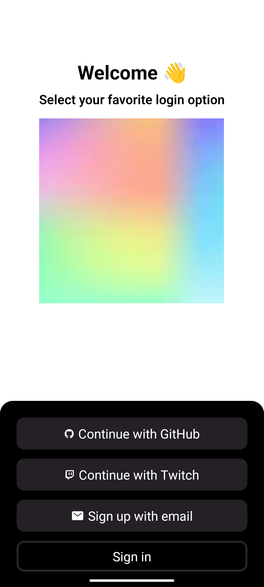
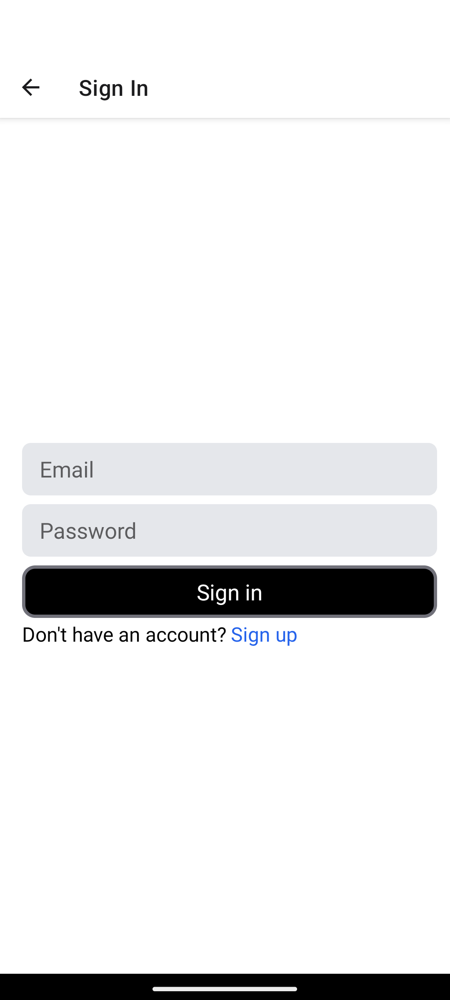
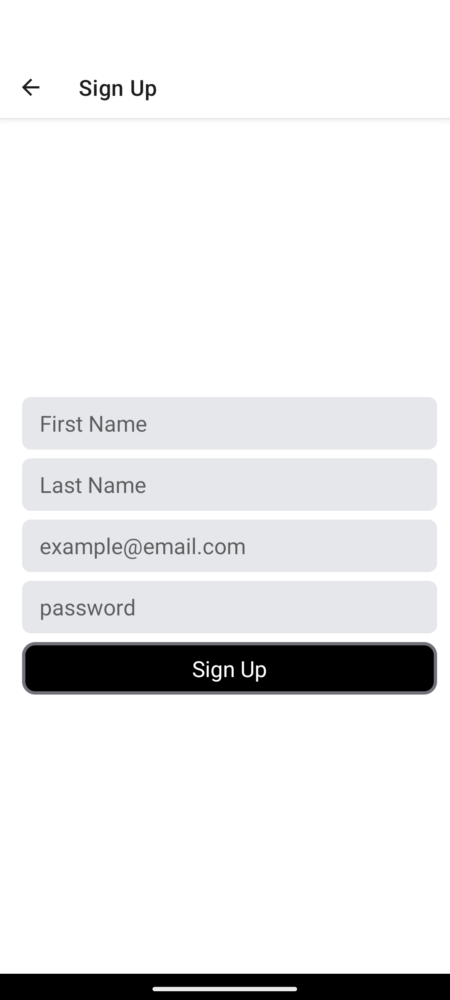
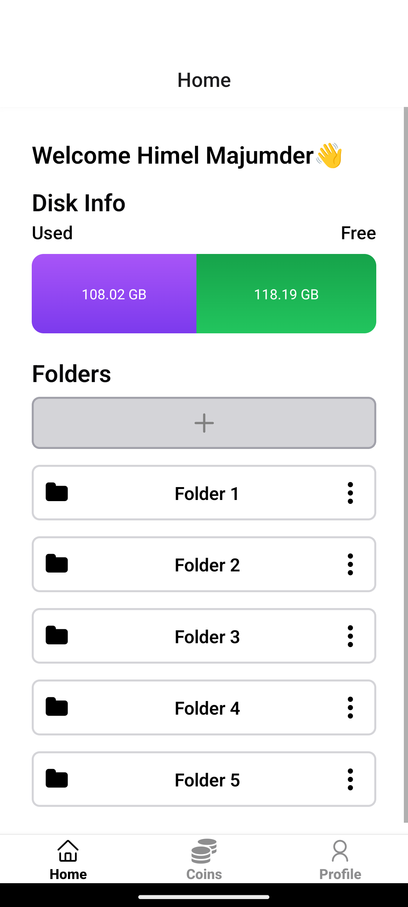
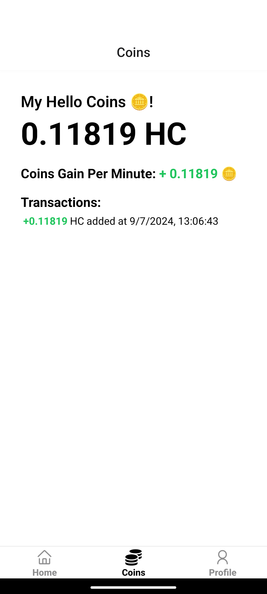
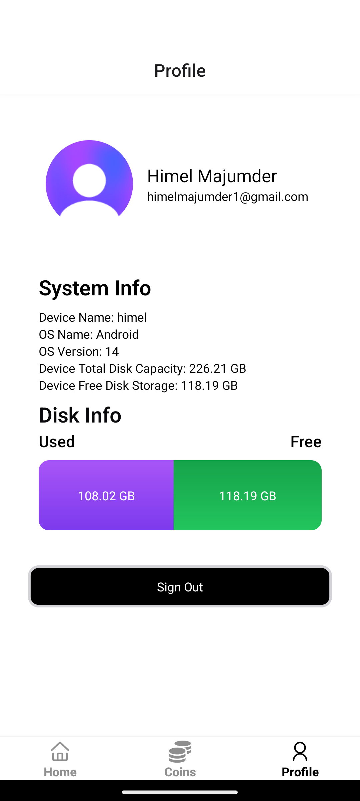

<h1 align="center">Hello App</h1>

<h3 align="center">Simple app of Hello App </h3>


## 📸 Screenshots


<div style="display: flex; flex-direction: row;">
  
  
  
  
  
  
</div>

## Demo Video

  <video controls width="80%">
    <source src="./assets/screenshots/hello-app.mp4" type="video/mp4">
    Your browser does not support the video tag.
  </video>

## 🛠 Technologies Used

- **expo**: Framework for building fast and modern apps
- **CSS/Tailwind CSS**: For design and layout.
- **TypeScript**: For functionality and interactivity.
- **Node.js**: For backend and dependency management.

## 🚀 Getting Started

1. **Clone this repository:**

   ```bash
   git clone https://github.com/himelmaj/hello-app.git
   cd hello.app/
2. **Install dependencies:**
   ```bash
    EXPO_PUBLIC_CLERK_PUBLISHABLE_KEY=changethis
3. **Update environment variables:** 
   ```bash
    npm install
4. **Start the development server:**
   ```bash
    npm start
## 📝 License

This project is under the MIT license. See the [LICENSE](LICENSE) file for more details.

---

Made with ❤️ by Himel Majumder [Get in touch](https://himelmaj.zeabur.app/)